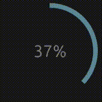

# egui Circular Progress Bar

A customizable circular progress bar widget for [egui](https://github.com/emilk/egui), the immediate mode GUI library for Rust.



## Features

- Easy integration with existing egui applications

## Installation

Add this to your `Cargo.toml`:

```toml
[dependencies]
egui-circular-progress-bar = "0.1.0"
egui = "0.31"
```

## Quick Start

```rust
use egui_circular_progress_bar::CircularProgressBar;

fn main() -> Result<(), eframe::Error> {
    let options = eframe::NativeOptions::default();
    eframe::run_native(
        "Circular Progress Bar Demo",
        options,
        Box::new(|_cc| Box::new(MyApp::default())),
    )
}

struct MyApp {
    progress: f32,
}

impl Default for MyApp {
    fn default() -> Self {
        Self { progress: 0.3 }
    }
}

impl eframe::App for MyApp {
    fn update(&mut self, ctx: &egui::Context, _frame: &mut eframe::Frame) {
        egui::CentralPanel::default().show(ctx, |ui| {
            ui.heading("Circular Progress Bar Demo");
            
            // Basic usage
            CircularProgressBar::new(self.progress)
                .size(100.0)
                .show(ui);
            
            ui.slider(&mut self.progress, 0.0..=1.0, "Progress");
        });
    }
}
```

## Examples

Check out the `examples/` directory for more detailed usage examples:

- `demo.rs` - Simple demo for the circular progress bar

Run examples with:
```bash
cargo run --example demo
```

## Contributing

Contributions are welcome! Please feel free to submit a Pull Request. For major changes, please open an issue first to discuss what you would like to change.


## Acknowledgments

- [egui](https://github.com/emilk/egui) - The amazing immediate mode GUI library

